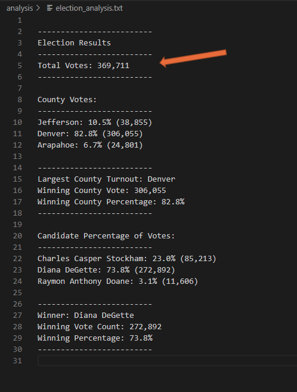

# Election_Analysis

## Table of Contents

- [Overview of Election Audit](#overview-of-election-audit)
- [Election Audit Results](#election-audit-results)
- [Election Audit Summary](#election-audit-summary)

## Overview of Election Audit
> Explain the purpose of this election audit

A Colorado Board of Elections worker has given you the accompanying undertaking to finish the election audit of a recent local congressional election.

- Compute the all-out number of votes cast. 
- Get a total rundown of up-and-comers who got votes. 
- Compute the complete number of votes every applicant got. 
- Compute the level of votes every competitor won. 
- Decide the victor of the political decision dependent on the well-known vote.

In the wake of giving you an outline of the political race review errands, we need to go over the means needed exhaustively. Showing you a method normally utilized by developers to compose steps of their code, which is called pseudocode. Pseudocode will make the review simpler to present to non-specialized associates and partners.

In this undertaking, our last Python content should have the option to convey the accompanying data when the content is run: 

- All out number of votes cast 
- A total rundown of up-and-comers who got votes 
- All out number of votes every competitor got 
- Level of votes every competitor won 
- The victor of the political decision dependent on famous vote

## Election Audit Results

> How many votes were cast in this congressional election?
  - 
> Provide a breakdown of the number of votes and the percentage of total votes for each county in the precinct.
> Which county had the largest number of votes?
> Provide a breakdown of the number of votes and the percentage of the total votes each candidate received.
> Which candidate won the election, what was their vote count, and what was their percentage of the total votes

## Election Audit Summary
