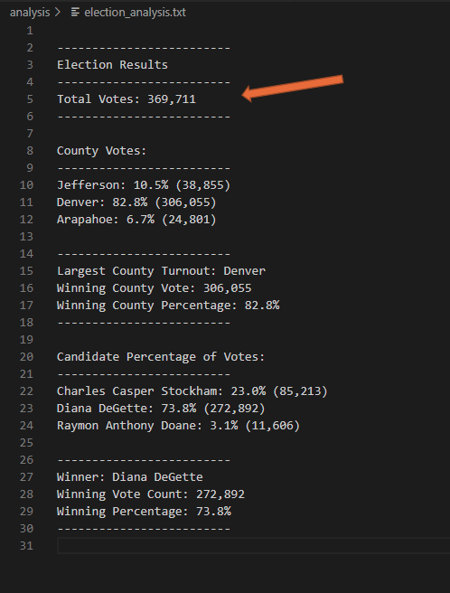
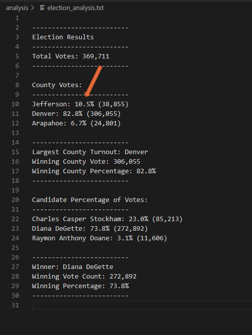
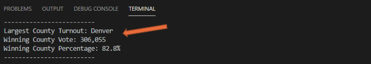
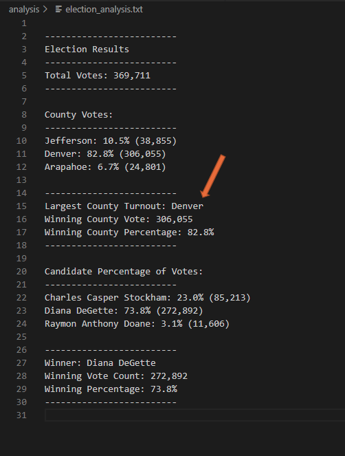
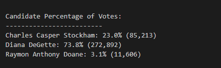

# Election_Analysis

## Table of Contents

- [Overview of Election Audit](#overview-of-election-audit)
- [Election Audit Results](#election-audit-results)
- [Election Audit Summary](#election-audit-summary)

## Overview of Election Audit
> Explain the purpose of this election audit

A Colorado Board of Elections worker has given you the accompanying undertaking to finish the election audit of a recent local congressional election.

- Compute the all-out number of votes cast. 
- Get a total rundown of up-and-comers who got votes. 
- Compute the complete number of votes every applicant got. 
- Compute the level of votes every competitor won. 
- Decide the victor of the political decision dependent on the well-known vote.

In the wake of giving you an outline of the political race review errands, we need to go over the means needed exhaustively. Showing you a method normally utilized by developers to compose steps of their code, which is called pseudocode. Pseudocode will make the review simpler to present to non-specialized associates and partners.

In this undertaking, our last Python content should have the option to convey the accompanying data when the content is run: 

- All out number of votes cast 
- A total rundown of up-and-comers who got votes 
- All out number of votes every competitor got 
- Level of votes every competitor won 
- The victor of the political decision dependent on famous vote

## Election Audit Results

> How many votes were cast in this congressional election?

  - Total Votes Cast in this congressional election was 369,711
 
> Provide a breakdown of the number of votes and the percentage of total votes for each county in the precinct.

  - Jefferson county has 10.5% total percentage with a total votes of 38,855
  - Denver county has the 82.8% total percentage with a total votes of 306,055
  - Arapahoe county has 6.7% total percentage with a total votes of 24,801

> Which county had the largest number of votes?

  - Denver county has the largest number total of 306,055
  - In addition, Denver county has the total votes percentage of 82.8%
  - Denver county is the Largest County Turnout

> Provide a breakdown of the number of votes and the percentage of the total votes each candidate received.

  - Charles Casper Stockham candidate has 23.0% total percentage with a total votes of 85,213
  - Diana DeGette candidate has the 73.8 total percentage with a total votes of 272,892
  - Raymon Anthony Doane candidate has 3.1% total percentage with a total votes of 11,606

> Which candidate won the election, what was their vote count, and what was their percentage of the total votes

  - Diana DeGette won the election, with a total votes of 272,892
  - In addition, Diana DeGette has the total percentage votes of 73.8%
  - Diana DeGette is the Winner!

## Election Audit Summary

This content can be altered for various future purposes by having it run different assignments to get a more profound arrangement in case somebody was a mission director for a competitor. We could investigate urban communities and not simply areas. We can go into a more inside and out take a gander at which urban communities stand firm on a huge footing in deciding whether an applicant will the champ of the political decision. Clearly, we would need to accumulate this information and information it into our election_results.csv document, then, at that point essentially do a similar idea as we accomplished for our district's part in this content. This model can be utilized for future purposes for contenders to perceive how to win a future political race.
